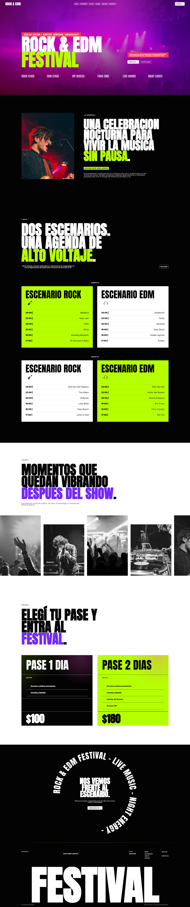
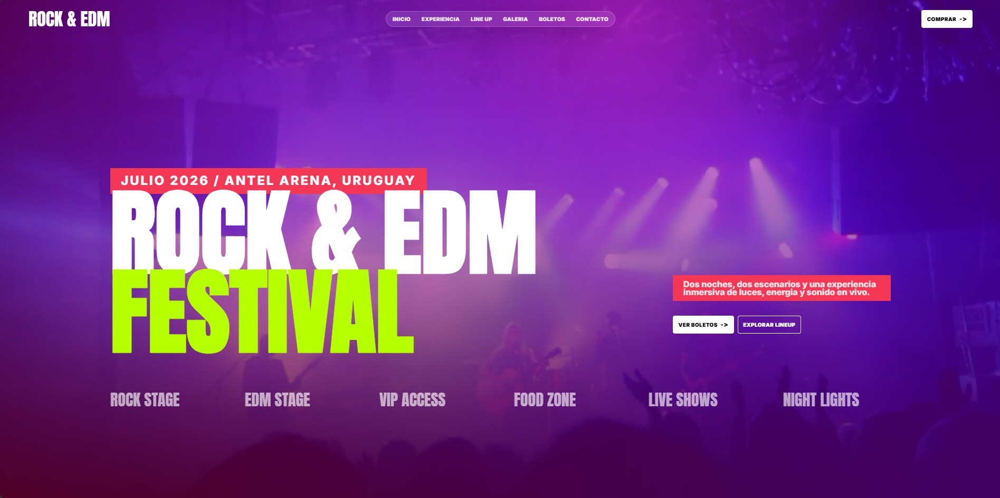
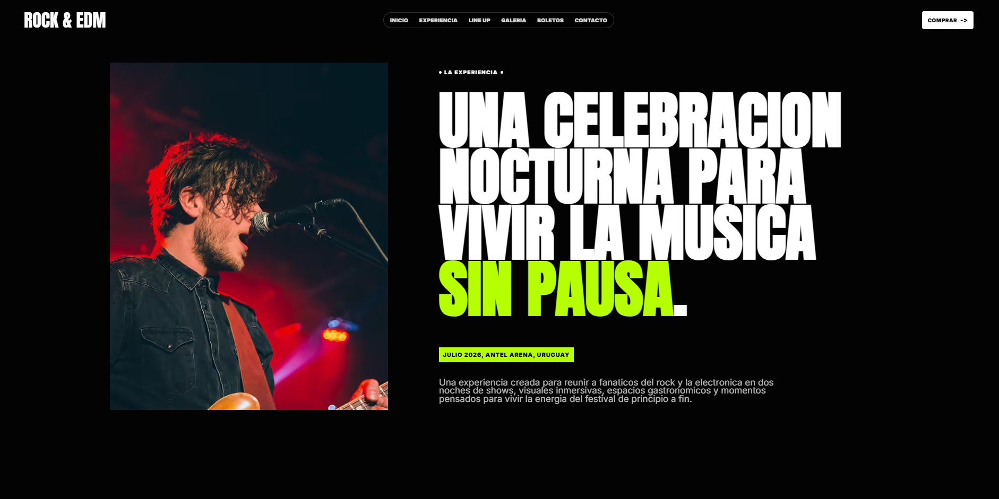
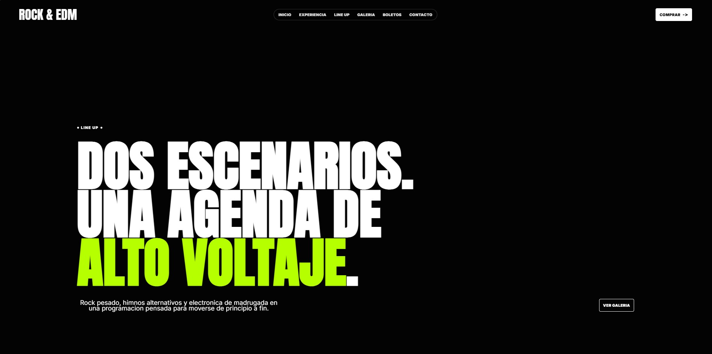
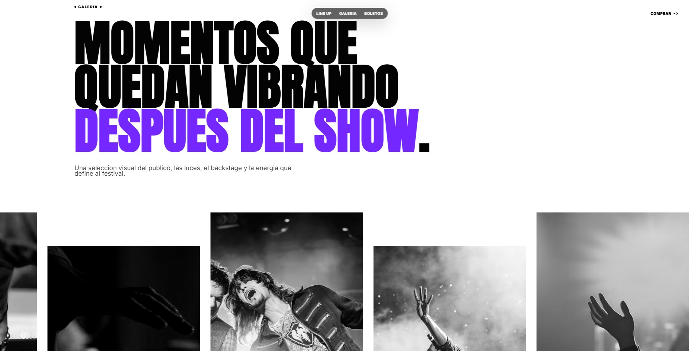
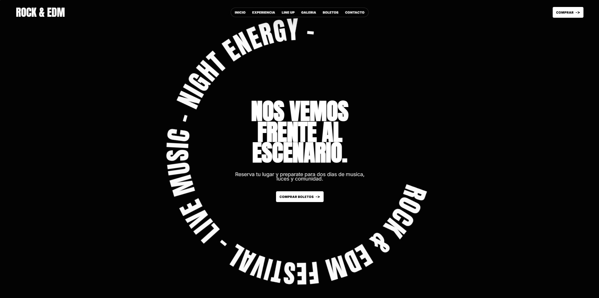

# Rock & EDM Festival

Landing page moderna para un festival ficticio de rock y electrónica, desarrollada con **HTML5**, **Sass/SCSS**, **JavaScript** y **Gulp**.

Este proyecto nació como una práctica del curso de desarrollo web y fue modernizado años después con una estética propia, más actual, editorial y visualmente fuerte. La idea fue llevar el proyecto a un nivel más profesional para usarlo como pieza de portfolio front-end.

> Proyecto de portfolio. No representa un evento real ni una venta real de entradas.

---

## Vista previa



---

## Capturas del proyecto

### Hero principal



### Sección experiencia



### Sección line up



### Galería



### Cierre / llamada a la acción



### Vista completa


---

## Sobre el proyecto

**Rock & EDM Festival** es una landing page de una sola página enfocada en promocionar un evento musical ficticio en el Antel Arena, Uruguay.

El rediseño busca alejarse del estilo clásico del proyecto original y llevarlo hacia una dirección visual más moderna, con una identidad inspirada en festivales nocturnos, cartelería musical, tipografía de alto impacto, contrastes fuertes y composición visual tipo editorial.

El sitio incluye secciones para:

- Hero principal con estética inmersiva.
- Descripción de la experiencia del festival.
- Line up dividido por escenarios y días.
- Galería visual.
- Cards de boletos.
- Llamados a la acción.
- Footer con información del evento.

---

## Tecnologías utilizadas

- **HTML5**
- **Sass / SCSS**
- **JavaScript**
- **Gulp 4**
- **PostCSS**
- **Autoprefixer**
- **CSSNano**
- **Terser**
- **WebP / AVIF** para optimización de imágenes

---

## Instalación y uso local

Clonar el repositorio:

```bash
git clone https://github.com/nathandb7/Web-Festival.git
cd Web-Festival
```

Instalar dependencias:

```bash
npm install
```

Compilar el proyecto:

```bash
npx gulp build
```

Modo desarrollo:

```bash
npx gulp dev
```

---

## Deploy en Netlify

Configuración recomendada para este proyecto:

```txt
Base directory: /
Build command: npx gulp build
Publish directory: /
```

Este proyecto no publica desde `dist`, porque los archivos HTML están en la raíz y Gulp genera los assets compilados dentro de la carpeta `build/`.

Estructura esperada después del build:

```txt
index.html
build/css/
build/js/
build/img/
capturas/
```

---

## Carpeta de capturas

Las imágenes usadas en este README deben estar dentro de la carpeta:

```txt
/capturas
```

Con estos nombres exactos:

```txt
ROCK&EDM-1.jpg
ROCK&EDM-2.jpg
ROCK&EDM-3.jpg
ROCK&EDM-4.jpg
ROCK&EDM-5.jpg
screenshot.png
```

---

## Autor

Desarrollado y rediseñado por **Nathan de Barros**.

GitHub: [@nathandb7](https://github.com/nathandb7)

---

## Licencia

Este proyecto está publicado bajo la licencia MIT.

Podés ver, usar, modificar y compartir el código respetando los términos de la licencia.

Copyright (c) 2026 Nathan de Barros
